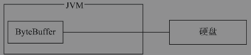

# javaSE 核心技术
- 多线程
```text
多线程可以使1个CPU几乎在同一时间运行更多的任务。在指定的时间单位内运行更多的任务，
其实就是大幅度提高运行效率，让软件运行更流畅，处理的数据更多，以提升使用软件时的用户体验
```
- 并发
```text
java.util.concurrent并发包提供了绝大多数常用的功能。
concurrent并发包是对多线程技术的封装，使用并发包中的类可以大幅度降低多线程代码的复杂度
并发包可以限制访问的流量、线程间的数据交流，
在同步处理时使用更加方便和高效率的锁（Lock）对象、读写锁对象，
以及可以提高运行效率的线程池，
支持异步及回调接口，
支持计划任务，
支持fork-join分治编程，
而且还提供了并发集合框架
```
- socket
```text
Socket技术可以实现不同计算机间的数据通信，从而实现在集群中的服务器之间进行数据交换
Java语言开发Socket软件时，内部调用的还是基于操作系统的Socket的API
JDK将Socket技术进行了重量级的封装，可以用最简单的代码实现复杂的功能，API接口设计得简洁、有序，因此，即使不懂C++，也能顺利地学习Socket编程。
掌握C++语言其实是更有益于学习底层对Socket的封装，研究一些细节问题时会应用到
Socket技术基于TCP/IP
Socket编程其实就是实现服务端与客户端的数据通信，不管使用任何的编程语言，在实现上基本上都是4个步骤：
①建立连接；②请求连接；③回应数据；④结束连接
```
- NIO
```text
NIO相比普通的I/O提供了功能更加强大、处理数据更快的解决方案，它可以大大提高I/O（输入/输出）吞吐量，常用在高性能服务器上
NIO实现高性能处理的原理是使用较少的线程来处理更多的任务
使用较少的Thread线程，通过Selector选择器来执行不同Channel通道中的任务，
执行的任务再结合AIO（异步I/O）就能发挥服务器最大的性能，大大提升软件运行效率。
```
## 缓冲区
- NIO
```text
常规的I/O（如InputStream和OutputStream）存在很大的缺点，就是它们是阻塞的，
而NIO解决的就是常规I/O执行效率低的问题。即采用非阻塞高性能运行的方式来避免出现以前“笨拙”的同步I/O带来的低效率问题。
NIO在大文件操作上相比常规I/O更加优秀，对常规I/O使用的byte[]或char[]进行封装，采用ByteBuffer类来操作数据，
再结合针对File或Socket技术的Channel，采用同步非阻塞技术实现高性能处理
NIO技术中的核心要点：缓冲区（Buffer）。
缓冲区在NIO的使用中占据了很高的地位，因为数据就是存放到缓冲区中，并对数据进行处理
```
- java.nio.Buffer
```text
传统的I/O流API,InputStream和OutputStream，以及Reader和Writer联合使用时，
常常把字节流中的数据放入byte[]字节数组中，或把字符流中的数据放入char[]字符数组中，也可以从byte[]或char[]数组中获取数据来实现功能上的需求
在Java语言中对array数组自身进行操作的API非常少，常用的操作仅仅是length属性和下标[x]，
在JDK中也没有提供更加方便操作数组中数据的API，如果对数组中的数据进行高级处理，需要程序员自己写代码进行实现，处理的方式是比较原始的，
这个问题可以使用NIO技术中的缓冲区Buffer类来解决，它提供了很多工具方法，大大提高了程序开发的效率。
Buffer类是一个抽象类，它具有7个直接子类，
分别是ByteBuffer、CharBuffer、DoubleBuffer、FloatBuffer、IntBuffer、LongBuffer、ShortBuffer，
也就是缓冲区中存储的数据类型并不像普通I/O流只能存储byte或char数据类型
注意：
    Buffer类没有BooleanBuffer这个子类。
    类java.lang.StringBuffer是在lang包下的，
    在nio包下并没有提供java.nio.StringBuffer缓冲区，
    在NIO中存储字符的缓冲区可以使用CharBuffer类。
    NIO中的Buffer是一个用于存储基本数据类型值的容器，
    它以类似于数组有序的方式来存储和组织数据。
    每个基本数据类型（除去boolean）都有一个子类与之对应。
```
- Buffer类使用
    - 包装数据和获得容量
        - capacity（容量）
            - 包含元素的数量
            - 不能为负数
            - 不能更改
        - limit（限制）：缓冲区的限制，代表第一个不应该读取或写入元素的index
            - limit不能为负
            - limit不能大于capacity
            - 方法limit():获取此缓冲区的限制
            - 方法limit(int newLimit):设置此缓冲区的限制
        - position（位置）：代表下一个要读取或写入元素的index
            - 不能为负
            - 不能大于limit
            - 如果mark已定义且大于新的position则丢弃该mark
            - position():返回此缓冲区的位置
            - position(int newPosition):设置此缓冲区新的位置
        - remaining（剩余空间）：缓冲区剩余的空间大小，
            - remaining()：返回当前位置position与limit之间的元素个数，limit-position
        - mark（标记）:缓冲区的标记是一个索引，调用reset()方法，会将缓冲区的position重置为该索引
            - mark():在此缓冲区的位置设置标记
            - 不能为负
            - 不能大于position
            - 如果定义了mark，则在将position或limit调整为小于该mark的值时，该mark被丢弃，丢弃后的mark值是-1
            - 未定义mark，调用reset() 将导致抛出InvalidMarkException异常
    - isReadOnly():告知此缓冲区是否为只读缓冲区,七个返回值都是false
    - isDirect()：判断此缓冲区是否为直接缓冲区
        - 非直接缓冲区
        ```text
        通过ByteBuffer向硬盘存取数据时是需要将数据暂存在JVM的中间缓冲区，
        如果有频繁操作数据的情况发生，则在每次操作时都会将数据暂存在JVM的中间缓冲区，再交给ByteBuffer处理，
        这样做就大大降低软件对数据的吞吐量，提高内存占有率，造成软件运行效率降低
        ```
        - 直接缓冲区
        ```text
        直接缓冲区直接在内核空间中就进行了处理，无须JVM创建新的缓冲区，
        这样就减少了在JVM中创建中间缓冲区的步骤，增加了程序运行效率
        ```
    - clear():作用是防止读写缓冲区时越界。还原缓冲区到初始状态，源码如下
        ```text
        public final Buffer clear() {
                position = 0;
                limit = capacity;
                mark = -1;
                return this;
        }   
        ```
       - 主要使用场景，放在准备往缓冲区写入内容之前调用此方法，clear() 方法并不会清除缓冲区数据，只是还原position，limit，mark为初始值
    - flip(): 作用是防止读写缓冲区时越界。反转此缓冲区。首先将限制设置为当前位置，然后将位置设置为0,mark设置为初始值（相当于移除标记mark）
        ```text
        public final Buffer flip() {
                limit = position;
                position = 0;
                mark = -1;
                return this;
        }  
        ```
      - 使用场景：当向缓冲区中存储数据，然后再从缓冲区中读取数据。
    - hasArray():判断此缓冲区是否具有可访问的底层实现数组,是否有char[],int[]等数组
        ```text
        public final boolean hasArray() {
                return (hb != null) && !isReadOnly;
        }
        ```
      
```text
抽象类Buffer.java的7个子类也是抽象类，
也就意味着ByteBuffer、CharBuffer、DoubleBuffer、FloatBuffer、IntBuffer、LongBuffer和ShortBuffer这些类也不能被直接new实例化
需要借助静态方法wrap()进行实现。wrap()方法的作用是将数组放入缓冲区中，来构建存储不同数据类型的缓冲区
注意：
    缓冲区为非线程安全的

```