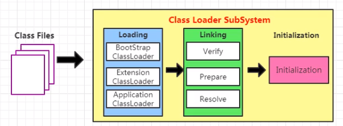
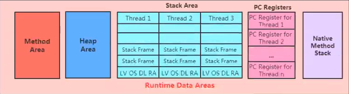
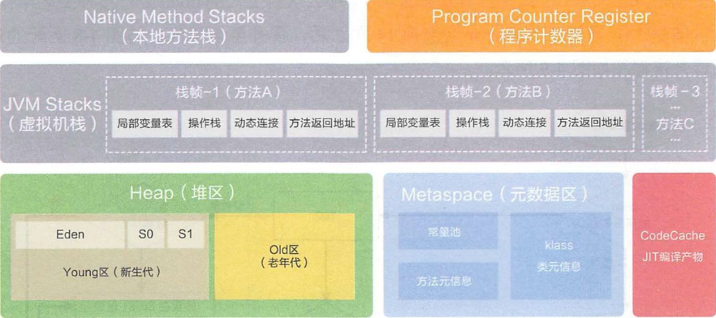
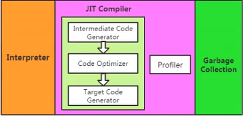
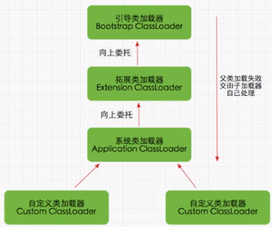
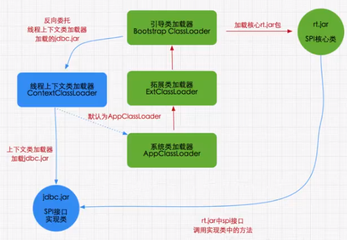
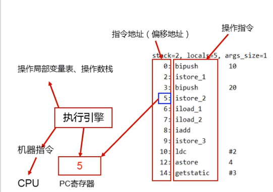

# JVM

## 所需插件

### javap

- javap -c xxx.class
- javap -l xxx.class

### IDEA jclasslib 插件

## JVM架构

- Class Loader subSystem 类加载子系统
    - 
    - loading 加载
        - Bootstrap ClassLoader c和c++实现的 引导/启动 类加载器（Java核心类库默认使用）
            1. 出于安全考虑Bootstrap只加载包名为java、javax、sun等开头的类
            2. JAVA_HOME/jre/lib下的内容
            3. sun.boot.class.path路径下的内容
            4. 没有父加载器
            5. 加载ExtensionClassloader和AppClassloader，并指定为他们的父类加载器
            6. c/c++实现，嵌套在JVM内部
        - Extension ClassLoader java实现的 扩展 类加载器
            1. 派生于ClassLoader类
            2. 父类加载器为BootstrapClassloader
            3. 从java.ext.dirs系统属性所指定的目录中加载类库
            4. 从JDK的安装路径jre/lib/ext子目录下加载类库（如果用户创建的JAR放在此目录下也会自动由ExtensionClassLoader加载）
            5. java语言编写
        - Application ClassLoader java实现的 系统 类加载器（自定义类型默认使用）
            1. java语言编写由sun.misc.Launcher$AppClassLoader实现
            2. 派生于ClassLoader
            3. 父类加载器为ExtensionClassLoader
            4. 加载环境变量classpath路径下的类库
            5. 加载系统属性java.class.path指定路径下的类库
        - 自定义类加载器
    - Linking 链接
        - Verify 验证
        - Prepare 准备
        - Resolve 解析
    - Initialization 初始化
- Runtime Data Areas 运行时数据区
    - 
    - 阿里巴巴
    - Program Counter Register 程序计数器 pc寄存器 每个线程一份
    - Stack Area 虚拟机栈 每个线程一份
        - stack frame 栈帧
        - local variables 局部变量表
        - operand stack 操作数栈
        - dynamic linking 动态链接
        - return address 方法返回地址
    - Native Method Stack 本地方法栈(调用c语言，与本地方法库、本地方法接口交互)
    - Heap Area 堆区 对象主体存放位置 GC主要管理的区域 多线程共享
    - Method Area 方法区 类信息，常量，域信息，方法信息 多线程共享(JVM规范)
        - HotSpot 有Method Area
            - JDK8 为元空间 metaspace
            - jdk6&7 为永久代 PermGen space
            - Method Area是JVM规范 metaspace、PermGen为method area的落地实现
        - J9（IBM）和JRockit（Oracle）没有Method Area
- Execution Engine 执行引擎
    - Interpreter 解释器
    - JIT Compiler 即时编译器
        - Intermediate Code Generator 中间代码生成器
        - Code Optimizer 代码优化器
        - Target Code Generator 目标代码生成器
        - Profiler 分析器
    - Garbage Collection 垃圾回收器
- Native Method Interface（JNI） 本地方法接口
- Native Method Library 本地方法库

## Class Loader subSystem

- 类加载器子系统负责从文件系统或者网络中加载class文件，class文件在文件开头有特定的文件标识
- ClassLoader只负责class文件的加载，能否运行由Execution Engine决定
- 加载的类信息存放于方法区，方法区中还会存放运行时常量池信息（final），字符串字面量和数字常量（这部分常量信息是class文件中常量池部分的内存映射）

### Loading

- 通过一个类的全限定名（全类名）获取定义此类的二进制字节流
- 将这个字节流所代表的静态存储结构转化为方法区的运行时数据结构
- 在内存中生成一个代表这个类的java.lang.Class对象，作为方法区这个类的各种数据的访问入口
- 加载.class文件方式
    - 从本地文件系统直接加载
    - 通过网络获取，典型场景Web Applet
    - 从压缩包中读取，jar包，war包基础
    - 运行时计算生成，动态代理技术
    - 由其他文件生成，JSP应用
    - 从专有数据库中提前.class文件，比较少见
    - 从加密文件中获取，防止反编译的保护措施

#### Java虚拟机规范

- 所有派生于抽象类ClassLoader的类加载器都划分为自定义类加载器

#### JVM支持两种类加载器

- Bootstrap ClassLoader 引导类加载器，c和c++实现，嵌套再jvm内部
- User-Defined ClassLoader 自定义加载器，java实现，派生于抽象类java.lang.ClassLoader

#### 常见类加载器

- 不是上下层关系，也不是父子类的继承关系，是包含关系，a文件夹里有b和c，类似这种包含关系
- 引导类加载器
    - Bootstrap Class Loader c和c++实现
    - 嵌套再jvm内部
    - 用来加载java核心库（JAVA_HOME/jre/lib/rt.jar、resources.jar或sun.boot.class.path路径下的内容）用于提供JVM自身需要的类
    - 并不继承自java.lang.ClassLoader，没有父加载器
    - 加载扩展类和应用程序类加载器，并指定为他们的父类加载器
    - 处于安全考虑，Bootstrap启动类加载器只加载包名为java、javax、sun等开头的类
- 自定义类加载器
    - Extension Class Loader
        - java语言编写由sun.misc.Launcher的静态内部类static class ExtClassLoader extends URLClassLoader实现
        - 派生于ClassLoader
        - 父类加载器为 Bootstrap Class Loader
        - 从java.ext.dirs系统属性所指定的目录中加载类库
        - 从JDK的安装目录jre/lib/ext子目录（扩展目录）下加载类库，如果用户创建的jar放在此目录下，也会自动由扩展类加载器加载
    - System Class Loader
        - java语言编写由sun.misc.Launcher的静态内部类static class AppClassLoader extends URLClassLoader实现
        - 派生于ClassLoader
        - 父类加载器为 Extension Class Loader
        - 负责加载环境变量classpath或系统属性java.class.path指定路径下的类库
        - 程序中的默认类加载器，一般java应用的类都是由其来完成加载
        - 通过CLassLoader.getSystemClassLoader()可以获取到该类加载器
    - User Defined Class Loader

#### 自定义类加载器

- java日常应用程序开发中，类加载几乎是由上述3种类加载器相互配合执行的，在必要时，我们还可以自定义类的加载器，来定制类的加载方式
- 自定义类加载器功能
    - 隔离加载类
        - 引入多个框架或中间件时，防止同名同路径的类冲突，进行仲裁，防止冲突
    - 修改类加载的方式
        - 需要时加载 动态加载
    - 扩展加载源
        - 字节码文件的来源方式，本地，网络，数据库等
    - 防止源码泄漏
        - 防止反编译，篡改对class文件加密

1. 开发人员可以通过继承抽象类java.lang.Classloader类的方式实现自己的类加载器
2. JDK1.2之前，在自定义类加载器时，总会去继承ClassLoader类并重写loadClass方法，来实现自定义的类加载器
3. JDK1.2之后，不再建议用户去重写loadClass方法，建议把自定义的类加载逻辑协助findClass方法中
4. 在编写自定义类加载器时，如果没有太过于复杂的需求，可以直接继承URLClassLoader类，这样就可以避免自己去编写findClass方法及其获取字节码流的方式，使自定义类加载器编写更简洁

### Linking

#### Verify

- 确保class文件的字节流中包含的信息符合当前虚拟机要求，保证被加载类的正确性，保证不会危害虚拟机自身安全
- 验证方式
    - 文件格式验证
    - 元数据验证
    - 字节码验证
    - 符号引用验证

#### Prepare

- 为类变量分配内存并且设置该类变量的默认初始值（int i=1; 此时i=0）
- 不包含用final修饰的static静态常量，因为final在编译时分配，prepare阶段会显示初始化
- 这里不会为实例变量分配初始化，类变量会分配在Method Area方法区，而实例变量会随着对象一起分配到Heap Area堆区

#### Resolve

- 将常量池内的符号引用转换为直接引用的过程
- 事实上，Resolve解析操作往往会伴随JVM在执行完初始化之后再执行
- 符号引用就是一组符号来描述所应用的目标，符号引用的字面量形式明确定义在《java虚拟机规范》的class文件格式中。 直接引用就是直接指向目标的指针、相对偏移量或一个间接定位到目标的句柄
- 解析动作主要针对类或接口、字段、类方法、接口方法、方法类型等。对应常量池中
    - CONSTANT_Class_info
    - CONSTANT_Fieldref_info
    - CONSTANT_Methodref_info
    - ......

### Initialization

- 初始化阶段就是执行类构造器方法（不是类的构造器） <clinit>() 的过程（当有静态变量赋值，静态代码块赋值时才会有clinit）
- 此方法不需要定义，是javac编译器自动收集类中的所有类静态变量的赋值动作和静态代码块中的语句合并而来
- 构造器方法中指令按语句在源文件中出现的顺序执行
- <clinit>() 不同于类的构造器
    - 构造器是jvm视角下的<init>()
- 若该类具有父类，jvm会保证 父类的<clinit>() 执行完毕后 子类的 <clinit>()执行
- jvm必须保证一个类的<clinit>() 方法在多线程下被同步加锁
    - 类只会被加载一次，并放置到method area（metadata）

### 双亲委派机制

- JVM对class文件采用的是按需加载的方式，当需要使用该类时才会将它的class文件加载到内存生产Class对象
- JVM采用双亲委派机制，即把请求交给父类处理，一种任务委派模式
- 加载jdbc.jar 
- 工作原理
    1. 如果一个类加载器收到了类加载的请求，并不会先去加载，而是把这个请求委托给父类的加载器去执行
    2. 如果父类加载器还存在其他父类加载器，则进一步向上委托，依次递归，请求最终将到达顶层的BootstrapClassloader
    3. 如果父类加载器可以完成类加载任务，就成功加载返回如果父类加载器不能完成加载任务，子加载器才会尝试自己去加载
- 优势
    1. 避免类的重复加载
    2. 保护程序安全，防止核心API被随意篡改:
        - 自定义java.lang.String.main():Error: Main method not found in class java.lang.String
        - 自定义类java.lang.MyBougainvillea:Exception in thread "main" java.lang.SecurityException: Prohibited package name:
          java.lang

### 沙箱安全机制

- 自定义java.lang.String类，加载自定义String类的时候根据双亲委派原则会率先使用BootstrapClassLoader加载
- 此时加载的是jdk自带的rt.jar包中java\lang\String.class 报错信息说没有main方法是因为rt.jar下的String类没有main方法
- 这样保证对java核心源代码的保护这就是沙箱安全机制

### 类的主动使用和被动使用

- 判断JVM中两个Class对象是否为同一个类
    1. 类的完整类名必须一致，包括包名
    2. 加载这个类的ClassLoader（指ClassLoader实例对象）必须相同
- 在JVM中即使这两个类对象（Class对象）来源同一个class文件，被同一个虚拟机所加载，但只要加载他们的ClassLoader实例对象不同那么这两个类对象（Class对象）也是不相等的
- JVM必须知道一个类型是由启动类加载器加载还是由用户类加载器加载
- 如果一个类型是由用户类加载器加载，那么JVM会将这个类加载器的一个引用作为类型信息的一部分保存在方法区中
- （动态链接）当解析一个类型到另一个类型的引用的时候，JVM需要保证这两个类型的类加载器是相同的

#### 主动使用

- 类会执行 Initialization 阶段

1. 创建类的实例
2. 访问某一个类或接口的静态变量或者对静态变量赋值
3. 调用类的静态方法
4. 反射：Class.forName("org.bougainvillea.Test")
5. 初始化一个类的子类(加载一个类的时候其父类会先初始化)
6. JVM启动时被标明为启动类的类
7. JDK7开始提供的动态语言支持
    - java.lang.invoke.MethodHandle实例的解析结果
    - REF_getStatic、REF_putStatic、REF_invokeStatic句柄对应类没有初始化则初始化

#### 被动使用

- 类不会执行 Initialization 阶段
- 除了主动使用的七种情况，其他使用java类的方式都被看作是对类的被动使用，都不会导致类的初始化

## runtime data area

### 备注

- 内存
    ```text
    是非常重要的系统资源，是硬盘和cpu的中间仓库及桥梁，承载着操作系统和应用程序的实时运行。
    JVM内存布局规定了java在运行过程中内存申请、分配、管理的策略，保证了JVM的高效稳定运行。
    不同的JVM对于内存的划分方式和管理机制存在着部分差异。
    ```

- JVM 定义了若干种程序运行期间会使用到的运行时数据区
    - 一些随着JVM启动而创建，随着JVM退出而销毁
        1. heap 堆内存
        2. 堆外内存
            1. method area「jdk8采用metaspace元空间/永久代，为method area的落地实现」
            2. 代码缓存「JIT编译产物」
    - 一些与线程一一对应，与线程对应的数据区会随着线程开始和结束而创建和销毁
        1. program counter registers pc寄存器
        2. stack 栈
        3. native stack 本地方法栈
- public class Runtime extends Object
    ```text
    每个JVM只有一个Runtime实例。即为运行时环境
    Every Java application has a single instance of class Runtime that allows the application to interface with the
    environment in which the application is running. The current runtime can be obtained from the getRuntime method.
    ```

### 线程

- 线程是一个程序里的运行单元。JVM允许一个应用有多个线程并行的执行
- HotspotJVM里，每个线程都与操作系统的本地线程直接映射
    - 当一个java线程准备好执行以后，一个操作系统的本地线程也同时创建，java线程执行终止后本地线程也会回收
    - 操作系统负责所有线程的安排调度到任何一个可用的cpu上，一旦本地线程初始化成功，会调用java线程中的run()方法
    - 线程出现异常
        - 捕获处理异常也相当于java线程正常终止
        - 未捕获处理异常，java线程肯定终止，此时操作系统还要判断一下是否要终止JVM
            - 守护线程 demon线程，如果JVM中只剩demon线程则JVM可以退出
            - 非守护线程 当前线程为最后一个非守护线程则终止

#### hotspotJVM的后台系统线程

- 使用jconsole或者其他调试工具，能看到后台有许多线程在运行，不包括main方法的main线程以及所有这个main线程自己创建的线程

1. 虚拟机线程

    ```
    这种线程的操作是需要JVM达到安全点才会出现。
    这些操作必须在不同线程中发生的原因是他们都需要JVM达到安全点，这样heap才不会变化。
    这种线程的执行类型包括“stop-the-world”的垃圾收集、线程栈收集、线程挂起、偏向锁撤销。
    ```

2. 周期任务线程
    ```
    这种线程是时间周期事件的体现（比如中断），他们一般用于周期性操作的调度执行
    ```
3. GC线程
    ```
    这种线程对在JVM里不同种类的垃圾收集行为提供了支持
    ```
4. 编译线程
    ```
    这种线程在运行时会将字节码编译成本地代码
    ```
5. 信号调度线程
    ```
    这种线程接收信号并发送给JVM,在它内部通过调用适当的方法进行处理
    ```
### Program Counter Register
- The Java® Virtual Machine Specification Java SE 8 Edition
    ```text
    2.5.1 The pc Register
    The Java Virtual Machine can support many threads of execution at once (JLS
    §17). Each Java Virtual Machine thread has its own pc (program counter) register.
    At any point, each Java Virtual Machine thread is executing the code of a single
    method, namely the current method (§2.6) for that thread. If that method is not
    native, the pc register contains the address of the Java Virtual Machine instruction
    currently being executed. If the method currently being executed by the thread is
    native, the value of the Java Virtual Machine's pc register is undefined. The Java
    Virtual Machine's pc register is wide enough to hold a returnAddress or a native
    pointer on the specific platform.
    ```
- 翻译为：PC寄存器、程序计数器、程序钩子
- 并非是广义上的物理寄存器，PC寄存器是对物理PC寄存器的一种抽象模拟
- CPU物理寄存器存储指令的现场信息，cpu只有把数据装载到寄存器才能够运行
- 介绍
    1. PC寄存器用来存储指向下一条指令的地址，也即是将要执行的指令代码。由Execution Engine读取下一条指令
    2. 是一块很小的内存空间，几乎可以忽略不计，也是运行速度最快的存储区域
    3. JVM规范中，每个线程都有它自己的程序计数器（记录线程执行到那个位置），是线程私有的，生命周期与线程的生命周期保持一致
    4. 任何时间一个线程都只有一个方法在执行即当前方法，PC寄存器存储当前线程正在执行的java方法（方法有一系列指令）中的将要执行的jvm指令地址
    5. 当执行本地方法native method（c语言的方法） PC寄存器则是指向undefined，此处涉及native method stack
    6. 程序控制流的指示器，分支、循环、跳转、异常处理、线程恢复等基础功能都依赖PC寄存器
    7. 字节码解释器工作时就是通过改变PC寄存器的值来选取下一条需要执行的字节码指令
    8. 唯一一个在JVM规范中没有规定任何OutOfMemoryError情况的区域
- 例子
- 为什么使用PC寄存器记录当前线程的执行地址
```text
CPU需要不停的切换各个线程，这时候切换回来以后，就得知道接着从哪开始继续执行
JVM字节码解释器就需要通过改变PC寄存器的值来明确下一条应该执行什么样的字节码指令
```
- PC寄存器为什么设定为线程私有
```text
多线程在一个特定的时间段内只会执行其中某一个线程的方法，CPU会不停地做任务切换，这样必然导致经常中断或恢复
为了能够准确记录各个线程正在执行的当前字节码指令地址，所以每个线程都分配一个PC寄存器
各个线程之间可以进行独立计算，从而不互相干扰。

由于CPU时间片轮限制
众多线程在并发执行过程中，任何一个确定的时刻，一个处理器或者多核处理器中的一个内核，只会执行某个线程中的一条指令
这导致经常中断或恢复

每个线程在创建后，都会产生自己的PC寄存器和StackFrame栈帧，PC寄存器在各个线程之间互不影响
```
- CPU时间片:CPU分配给各个程序的时间，每个线程被分配一个时间段，称为该线程的时间片，每个程序根据时间片轮流执行
- 并行 VS 串行
    - 并行: 多个CPU核心一起执行，某一时刻有多个线程在执行
    - 串行: 多个线程一起排队有序执行，某一时刻有一个线程在执行
- 并发：多个线程一起执行时，竞争获取cpu时间片，cpu分配时间片给这些线程，这些线程根据时间片轮流执行，故某一时刻其实只有一个线程在执行


