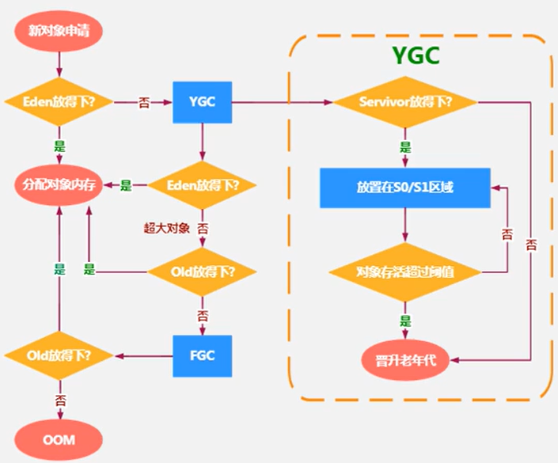

# heap area

## heap area核心概述

- 一个JVM实例只存在一个heap area，heap area是java内存管理的核心区域
- java heap area在JVM启动时即被创建，其空间大小也就确定了，是JVM管理的最大一块内存空间
    - heap area size是可以调节的
- java虚拟机规范 规定 heap可以处于物理上不连续的内存空间中，但在逻辑上它应该被视为连续的
- 所有线程共享java heap area 在这里还可以划分线程私有的缓冲区（TLAB：Thread local allocation buffer）
- JVM规范对Java Heap描述为：所有对象实例以及数组都应当在运行时分配在堆上（The heap is the run-time data area from which memory for all class instances
  and arrays is allocated）
    - 几乎所有的对象实例都在这里分配内存，almost 不是 all
- 数组和对象可能永远不会存储在stack上，因为stack frame中保存引用，这个引用指向对象或者数组在堆中的位置
- 在方法结束后，堆中对象不会马上被移除，仅仅在垃圾收集的时候才会被移除
- heap area 是Garbage Collection执行垃圾回收的重点区域

## heap area 细分 现代垃圾收集器大部分都基于分代收集理论设计

- 新生区--新生代--年轻代
- 养老区--老年区--老年代
- 永久区--永久代

### java7及之前 堆内存 逻辑上 分为三部分

1. Yong Generation Space 新生区 Young/New
    1. Eden区
    2. Survivor区（只有一个存放数据，当jvm计算容量时只会考虑一个，所以Runtime.getRuntime().totalMemory()和Runtime.getRuntime().maxMemory()
       的值会少一个survivor区的大小）
        1. survivor 0 区
        2. survivor 1 区
2. Tenure Generation Space 养老区 Old/Tenure
3. Permanent Space 永久区 Perm

### java8及之后 堆内存 逻辑上 分为三部分

1. Yong Generation Space 新生区 Young/New
    1. Eden区
    2. Survivor区（只有一个存放数据，当jvm计算容量时只会考虑一个，所以Runtime.getRuntime().totalMemory()和Runtime.getRuntime().maxMemory()
       的值会少一个survivor区的大小）
        1. survivor 0 区
        2. survivor 1 区
2. Tenure Generation Space 养老区 Old/Tenure
3. Meta Space 元空间 Meta

### Java对象

```text
存储在JVM中的java对象可以被划分为两类
1.生命周期较短的瞬时对象，这类对象的创建和消亡都非常迅速
2.生命周期非常长，在某些极端的情况下还能够与JVM的生命周期保持一致
```

### 新生代

1. 在Hotspot中Eden空间和另外两个Survivor空间缺省所占比例是8：1：1 ;通过-XX:SurvivorRatio=8(默认为8，但是实际比例是6：1：1 -XX:
   +UseAdaptiveSizePolicy默认开启了自适应内存分配策略，显式添加参数才会生效) 调整比例
2. 几乎所有的Java对象都是在Eden区被new出来
3. 绝大部分的Java对象的销毁都在新生代进行
    - IBM公司的专门研究表明，新生代中80%的对象都是朝生夕死
4. 可以使用选项-Xmn设置新生代最大内存大小
    - 这个参数一般使用默认值就可以了

### 老年代

### 对象分配过程

- 注意
    - 当Eden区满时才会触发YGC，Survivor0或1区满不会触发YGC
    - YGC回收Eden区和From区（YGC后会清空Eden区和From区）
    - Survivor 0区和Survivor 1区大小1：1，肯定会有一个为空。为了使用复制算法，目的是解决碎片化问题 
    - Survivor 0区和Survivor 1区：复制之后有交换，谁空谁时To区
    - Garbage Collection频繁在Young区收集，很少在Old区收集，几乎不在Perm/Meta收集
    - 对象可能直接分配在Old区
    - Eden区和To区满了，对象即使没达到阈值，也可能直接晋升到Old区
- 
```text
1. new的对象优先尝试放Eden区，Eden区可能已有对象
2. 如果Eden区剩余空间放得下，则直接在Eden区为对象分配内存
3. 如果Eden区剩余空间放不下，则触发Minor GC(YGC)，YGC会将Eden区和From区清空
    1. 将Eden区和From区内的不再被其他对象所引用的对象进行销毁。
    2. 将Eden区和From区内幸存的对象，移动到To区，并且标识移动次数加1次
    3. 此时Eden区为空，再次判断Eden区是否放得下
        1. 放得下则放Eden区
        2. 放不下则尝试放Old区（一般是超大对象）
            1. 放得下，直接将对象放置到Old区
            2. 放不下，则触发Major GC，回收一次Old区，再进行判断Old区是否放的下
                1. 放得下则直接将对象放置到Old区
                2. 放不下则OOM
4. Survivor 0区和Survivor 1区
    1. 当JVM进程第一次触发YGC。将Eden区内的不再被其他对象所引用的对象进行销毁。
    2. 将Eden区所有幸存对象，尝试移到Survivor 0区（会将Eden区清空）
        1. 当Survivor 0 区空间放得下则放在Survivor 0区，移动次数加1
        2. 幸存对象太大放不下，则直接晋升老年代，放到Old区，移动次数加1
    3. 当Eden区和Survivor 0或1区有数据时触发了YGC。此时JVM将Eden区和Survivor 0区（此时Survivor 0区称为From区）内不再被其他对象所引用的对象进行销毁。(此时的From区要根据实际情况来定，此处只是例子说明)
        1. 尝试将幸存的对象移动到Survivor 1区（此时也叫To区）。
            1. 当From区幸存对象阈值等于设置的值
                1. 则Promotion晋升老年代Old区，移动次数加1
            2. 当From区幸存对象阈值小于设置的值
                1. To区放得下则放到To区，移动次数加1
                2. To区放不下直接放Old区，移动次数加1（此时Old区正常设置参数肯定放的下，因为Young空间一般都比Old空间小）
    4. 之后就是重复3步 
```

# 工具

## 查看JVM进程内存

### jvisualvm

- C:\Program Files\Java\jdk1.8.0_191\bin\jvisualvm.exe
    - 当配置Path java环境变量可以直接输入jvisualvm启动
    - 工具-插件-Virtual GC

### jps & jstat -gc

- jps查看java进程获得进程号
- jstat -gc 进程号

```text
C:\Users\renqiankun>jps
2208 GradleDaemon
1300
12856 Jps
12968 GradleDaemon
808 Main
13772 HeapSpaceInitial

C:\Users\renqiankun>jstat -gc 13772
 S0C    S1C    S0U    S1U      EC       EU        OC         OU       MC     MU    CCSC   CCSU   YGC     YGCT    FGC    FGCT     GCT
25600.0 25600.0  0.0    0.0   153600.0  6144.0   409600.0     0.0     4480.0 775.8  384.0   76.4       0    0.000   0      0.000    0.000
```

### -XX:+PrintGCDetails

- 运行时加命令行参数-XX:+PrintGCDetails 运行时打印内存详细信息

```text
Heap
 PSYoungGen      total 179200K, used 6144K [0x00000000f3800000, 0x0000000100000000, 0x0000000100000000)
  eden space 153600K, 4% used [0x00000000f3800000,0x00000000f3e00188,0x00000000fce00000)
  from space 25600K, 0% used [0x00000000fe700000,0x00000000fe700000,0x0000000100000000)
  to   space 25600K, 0% used [0x00000000fce00000,0x00000000fce00000,0x00000000fe700000)
 ParOldGen       total 409600K, used 0K [0x00000000da800000, 0x00000000f3800000, 0x00000000f3800000)
  object space 409600K, 0% used [0x00000000da800000,0x00000000da800000,0x00000000f3800000)
 Metaspace       used 2637K, capacity 4486K, committed 4864K, reserved 1056768K
  class space    used 281K, capacity 386K, committed 512K, reserved 1048576K
```

### jps & jinfo -flag NewRatio / jinfo -flag SurvivorRatio

- 查看NewRatio

```text
C:\>jps
4448
2164 Jps
8324 GradleDaemon
3164 EdenSurvivortest

C:\>jinfo -flag NewRatio 3164
-XX:NewRatio=2

C:\>jinfo -flag SurvivorRatio 3164
-XX:SurvivorRatio=8

```

# JVM参数

## 设置heap area size

1. -Xms10M等价于-XX:InitialHeapSize 初始heap size 只影响新生区和养老区 默认情况初始内存大小：物理电脑内存大小 /64
2. -Xmx10M等价于-XX:MaxHeapSize 最大heap size 只影响新生区和养老区 默认情况最大内存大小：物理电脑内存带下 /4
3. 通常将-Xms -Xmx设置为相同的值，目的是为了能够在Java垃圾回收机制清理完堆区后不需要重新分割计算堆区的大小从而提高性能
4. 一旦堆区中的内存大小超过-Xmx所指定的最大内存时，将会抛出OutOfMemoryError异常
5. -XX:NewRatio=2 默认2，设置Young和Old的比例表示Young占1份，Old占2份；设置-XX:NewRatio=4，表示Young占1份，Old占4份
5. -Xmn100M （一般不使用）设置新生代Young的大小，当与-XX:NewRatio=2冲突时，-Xmn生效，
6. -XX:SurvivorRatio=8,(官方文档默认值8：1：1但实际是6：1：1，显式设置8才会生效),设置Young区下的Eden区和Young区下survivor0区、survivor1区的比例是8：1：1
7. -XX:-UseAdaptiveSizePolicy关闭自适应的内存分配策略
8. -XX:MaxTenuringThreshold=<N> 设置去老年区的阈值默认是15次
   